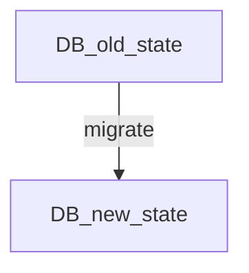
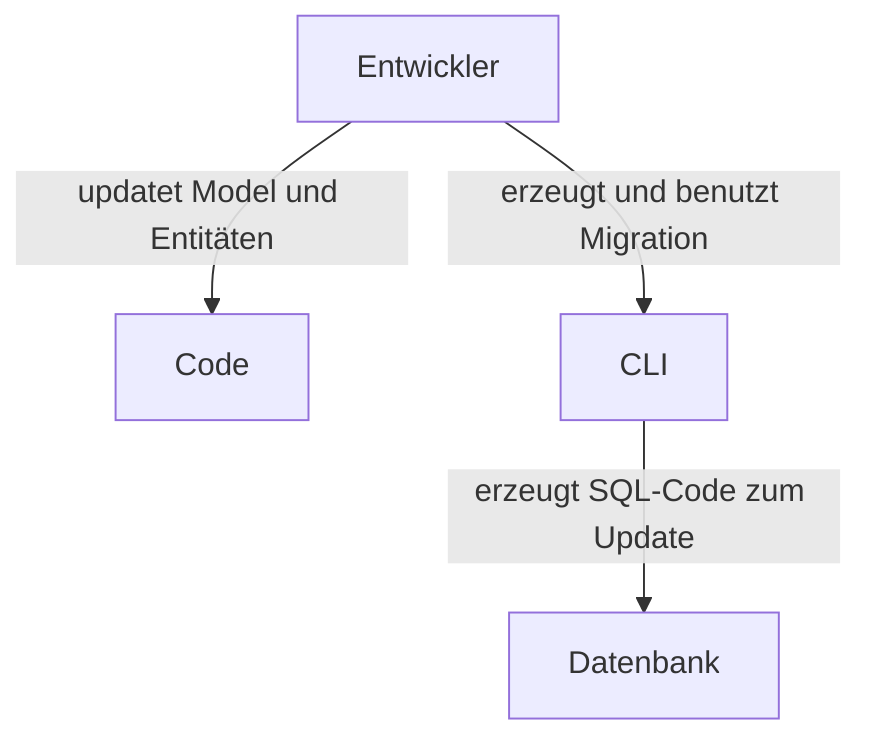
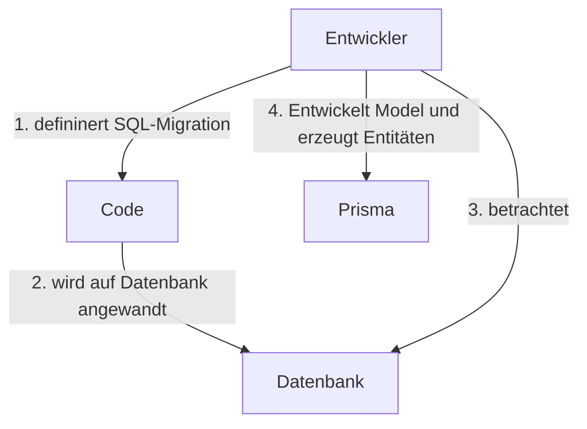

# Migrations 

## Model / Entity-First Migration:
----------
> Das Datenbankschema wird in Code defininiert und durch das Migrationstool Prisma Migration in SQL umgewandelt. 



## Database-first migration:
----------

> Der Entwickler erzeugt zuerst die Datenbank und passt die Models dann an die Datenbank an. 

# Datenbank aktualisieren
## Lokal
Zur Änderung der Datenbank wird das Model geändert:
```mermaid
graph TD;
Model-->prisma_migrate_dev;
prisma_migrate_dev-->|tracks state in migrations| Database;
````

